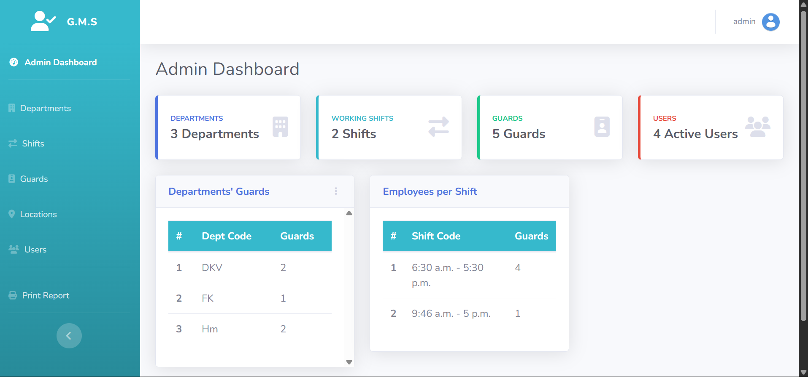
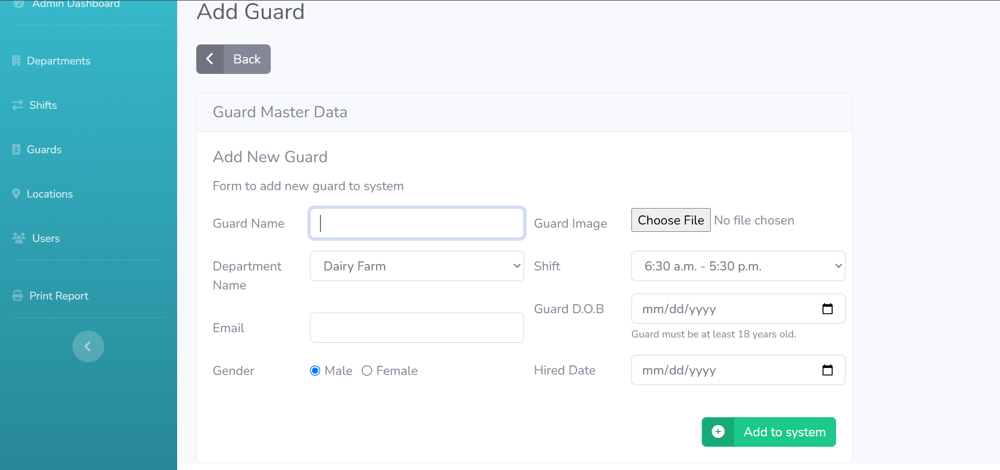
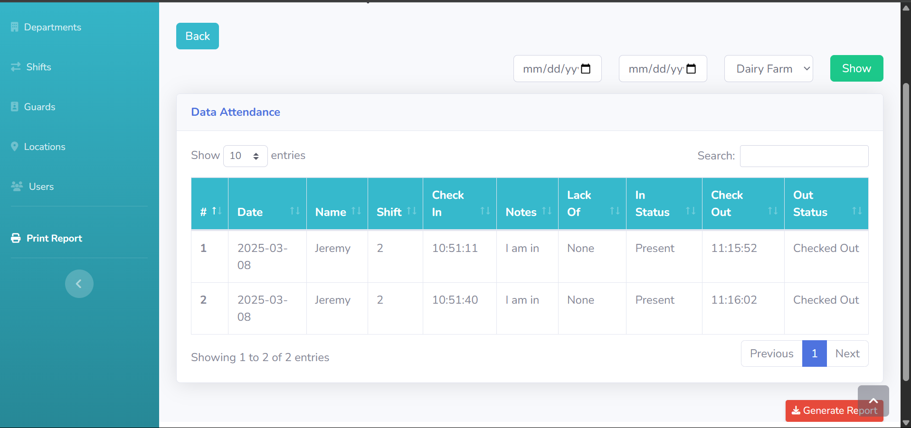

Here’s a **README.md** file for your **Guard Management System**. This file provides an overview of the project, setup instructions, and other relevant details.

---

# Guard Management System

The **Guard Management System** is a web-based application designed to manage guards, their attendance, shifts, and departments. It provides features for adding guards, managing their details, tracking attendance, and generating reports.

---

## Features

1. **Guard Management**:

   - Add, edit, and delete guards.
   - Assign guards to departments and shifts.
   - Upload guard profile pictures.

2. **Attendance Tracking**:

   - Guards can check in and check out.
   - Track attendance with timestamps and notes.

3. **Department and Shift Management**:

   - Add, edit, and delete departments.
   - Manage shifts (start and end times).

4. **Reporting**:

   - Generate attendance reports by date range and department.
   - Export reports in a printable format.

5. **User Management**:

   - Admins can create user accounts for guards.
   - Track active and inactive users.

6. **Validation**:
   - Prevent adding guards who are minors (under 18 years old).
   - Validate email uniqueness and other fields.

---

## Technologies Used

- **Frontend**:

  - HTML, CSS, JavaScript
  - Bootstrap (for styling)
  - jQuery (for dynamic interactions)

- **Backend**:

  - Django (Python web framework)
  - SQLite (default database for development)

- **Other Tools**:
  - Django Admin (for managing data)
  - Django Messages Framework (for user notifications)

---

## Setup Instructions

### Prerequisites

1. **Python**: Ensure Python 3.8 or higher is installed.
2. **Pip**: Ensure `pip` is installed to manage Python packages.

### Installation

1. **Clone the Repository**:

   ```bash
   git clone https://github.com/Sanga78/Guard-management-system.git
   cd guard-management-system
   ```

2. **Create a Virtual Environment**:

   ```bash
   python -m venv venv
   source venv/bin/activate  # On Windows: venv\Scripts\activate
   ```

3. **Install Dependencies**:

   ```bash
   pip install -r requirements.txt
   ```

4. **Run Migrations**:

   ```bash
   python manage.py migrate
   ```

5. **Create a Superuser**:

   ```bash
   python manage.py createsuperuser
   ```

6. **Run the Development Server**:

   ```bash
   python manage.py runserver
   ```

7. **Access the Application**:
   - Open your browser and go to `http://127.0.0.1:8000/`.
   - Use the superuser credentials to log in to the admin panel at `http://127.0.0.1:8000/admin/`.

---

## Usage

### Admin Dashboard

- **Add Guards**: Navigate to the "Add Guard" page to add new guards.
- **Manage Departments**: Add, edit, or delete departments.
- **Manage Shifts**: Add, edit, or delete shifts.
- **Generate Reports**: Use the "Generate Report" feature to create attendance reports.

### Guard Dashboard

- **Check In/Out**: Guards can check in and check out using their accounts.
- **View Attendance**: Guards can view their attendance history.

---

## Screenshots

### Admin Dashboard



### Add Guard Page



### Attendance Report



---

## Folder Structure

```
guard-management-system/
├── attendance/
│   ├── migrations/          # Database migrations
│   ├── templates/           # HTML templates
│   ├── admin.py             # Django admin configuration
│   ├── models.py            # Database models
│   ├── views.py             # Application views
│   ├── urls.py              # URL routing
│   └── ...
├── empattendance/
│   ├── settings.py          # Django settings
│   ├── urls.py              # Main URL routing
│   └── ...
├── manage.py                # Django management script
├── requirements.txt         # Python dependencies
└── README.md                # Project documentation
```

---

## Contributing

Contributions are welcome! Please follow these steps:

1. Fork the repository.
2. Create a new branch (`git checkout -b feature/YourFeatureName`).
3. Commit your changes (`git commit -m 'Add some feature'`).
4. Push to the branch (`git push origin feature/YourFeatureName`).
5. Open a pull request.

---

## Contact

For questions or feedback, please contact:

- **Kelvin Kipkosgei**: [kelvinkipkosgeisanga@gmail.com](mailto:kelvinkipkosgeisanga@gmail.com)
- **GitHub**: [Sanga](https://github.com/Sanga78)

---

## Acknowledgments

- Thanks to the Django community for providing an excellent web framework.
- Thanks to Bootstrap for making frontend development easier.

---

This README provides a comprehensive overview of your **Guard Management System**. You can customize it further based on your project's specific needs. Let me know if you need additional sections or modifications!
